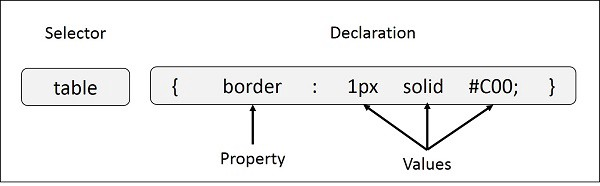
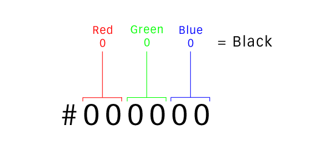

**CSS** stands for **C**ascading **S**tyle **S**heets. It helps us to design our pages and how the HTML elements are described in the screen and reduce the complexity of structural content. CSS handle looks part of the web page By using CSS we can handle the font size of the text, color of the text, space between the paragraph, the background of the page what we can use color or image. It also helps us how the web page is displayed on different screens and so on.

**Rules of CSS**

The rules of CSS divided into three specific parts.

**Selector:-** selector are used to select the content which you want to style.

**Property:-** “color” is an actual CSS property. Property sets the color of the text.

**Value:-** value is assigned to the property of how the color is shown.



**CSS Resets**

CSS Resets is used to remove the default browser style because every browser has their own style. For example, the way of display the content Opera is not similar to the other browser every browser has its own display properties because every browser is developed by different people. we can develop a similar style to every user that's why we can use CSS resets. CSS Resets remove all margin, padding,font-size,list-style-type of the elements. There is some type of CSS resets are used for example.

```
/* http://meyerweb.com/eric/tools/css/reset/
   v2.0 | 20110126
   License: none (public domain)
*/

html, body, div, span, applet, object, iframe,
h1, h2, h3, h4, h5, h6, p, blockquote, pre,
a, abbr, acronym, address, big, cite, code,
del, dfn, em, img, ins, kbd, q, s, samp,
small, strike, strong, sub, sup, tt, var,
b, u, i, center,
dl, dt, dd, ol, ul, li,
fieldset, form, label, legend,
table, caption, tbody, tfoot, thead, tr, th, td,
article, aside, canvas, details, embed,
figure, figcaption, footer, header, hgroup,
menu, nav, output, ruby, section, summary,
time, mark, audio, video {
    margin: 0;Example

div {
 background-color: fuchsia;
}
    padding: 0;
    border: 0;
    font-size: 100%;
    font: inherit;
    vertical-align: baseline;
}
/* HTML5 display-role reset for older browsers */
article, aside, details, figcaption, figure,
footer, header, hgroup, menu, nav, section {
    display: block;
}
body {
    line-height: 1;
}
ol, ul {
    list-style: none;
}
blockquote, q {
    quotes: none;
}
blockquote:before, blockquote:after,
q:before, q:after {
    content: '';
    content: none;
}
table {
    border-collapse: collapse;
    border-spacing: 0;
}
```

### Cascading

Cascade style work from Top to bottom and overwrite the style, for example, we can select the paragraph to a style and set the font-size:20px and color: red, and in the bottom of the stylesheet we can again style the same paragraph with its font-size: 25px and color: green,

```
p {
  font-size: 20px;
  color: red;
}

p {
  font-size: 25px;
  color:green;
}
```

The paragraph selector set the font-size: 25px and color: green because we can change the font-size and color of a paragraph at the bottom.

### Combining Selectors

Combining selector is a selector that explains the relationship between the selectors. we know how to use the combining selector. These selectors are more specific about which element we are going to select.

```
HTML
<div class="prent">
    <p>.....</p>
    <p>.....</p>
    <p class="child">.....</p>
  </div>
  
```

For example, we are going to select all paragraph elements inside the class parent and set the background color red.

```
CSS
 .parent p {
   background: red;
  }
```

we can select the paragraph element by using a selector. It selects each element of the paragraph and set their background red. suppose we can change the background yellow of the paragraph which class name is a child. That why we can use the combine selector.

```
.parent p.child {
  background: yellow;
  }
```

### Layering Styles with Multiple Classes

In HTML it is easy to set using multiple classes in a single element. But it important to set the space between the class attributes For example

```
  <button class="btn btn-submit">.....</button>
  <button class="btn btn-end">.....</button>
```

with the help of btn class we can provide the same style properties to both buttons like height, width, and font-size. If we want to set a different background color for both buttons so we can select the button with class name btn-submit and btn-end and set their different background colors.

```
.btn {
    height:150px;
    width:100px;
    font-size: 16px;
  }
.btn-error {
    background: red;
  }
.btn-success {
    background: green;
  }
```

### Colors

There are some ways to declare colors such as keyword, RGB, hexadecimal, and HSL

### Hexadecimal

**Example**

```
div {
 background-color: #000000;
}
```

The Hexadecimal value is always represented by three or six values and starts with the # sign.

### Keyword Values

key values are the name of the color that we set on CSS. For e.g Red, Green, Yellow, etc.

**Example**

```
div {
 background-color:red;
}
```

### RGB & RGBa

RGB stands for Red, Green, Blue it is always used as rgb().

**Example**

```
div {
 background-color: rgb(0, 0, 0);
}
```

The syntax format is:

```
rgb(red, green, blue)
```

we already know that:

-   0 is the minimum decimal value
-   255 is the maximum decimal value

### RGBA

RGB stands for Red, Green, Blue, and alpha it is always used as rgba().

**Example**

```
div {
 color: rgba(255, 255, 255, 0.2);
}
```

Alpha can be a value between 0 and 1.

The basic format of RGBA is:

```
rgba(red, green, blue, alpha)
```

### HSL and HSLa

HSL stands for Hue, Saturation,  and Lightness. The value starts with numbers 0 to 360. It shows the degree of color and wheel. the second and third value is the percentage value from 0 to 100. The value with `0` being completely black and `100%` being completely white.

The basic syntax is:

```
hsl(hue, saturation, lightness)
```

**Example**

```
div {
 background-color: hsl(240, 100%, 50%);
}
```

### HSLA

HSLA is the same as HSL with an added Alpha (A) parameter that allows us to specify the level of opacity of the color.

The basic syntax is:

```
hsla(hue, saturation, lightness, alpha)
```

Alpha can be a value between 0 and 1.

**Example**

```
div {
 color: hsla(120, 100%, 50%, 0.2);
}
```
