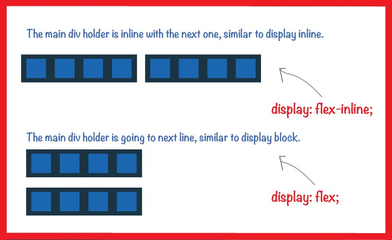

Flexbox is a new layout mode in CSS3. It helps us to design the items. Flex provides us with more efficiency to design elements.



**inline-flex** This value causes an element to generate an inline-level _flex container_ box.

**flex** This value causes an element to generate a block-level _flex container_ box.

**Terminology:(Flex Container and Flex Items)**

](./asset-2.png)

**Flex Container** Parent element where we apply “display: flex”

**Flex Items** This is a children element inside the flex container.

**Flex Direction**

](./asset-3.png)

Flix Direction helps us to determine the direction of the item. By default, the flex items are horizontally aligned. There are two terminologies for example `main-axis and cross-axis`.

**Main Axis** By default in the flexbox flex items is aligned horizontally.

Cross Axis The cross-axis items are aligned vertically from top to bottom.

### flex-direction

The flex-direction properties help us to specify the how the flex items are palced in flex container. The flex-direction property can accept four values

```
flex-direction: row || column || row-reverse || column-reverse;
```](./asset-4.jpeg)

### flex-wrap

The _flex-wrap_ property controls whether the flex container is _single-line_ or _multi-line._The `flex-wrap` property comes with three different values

```
flex-wrap: nowrap || wrap || wrap-reverse;
```](./asset-5.png)

### flex-flow

The _flex-flow_ property is a shorthand for setting the _flex-direction and flex wrap._ This property accepct two values flex-direction and flex-wrap.

### flex-order

This property allow to reorder the flex items without changing the source code of HTML.

](./asset-6.png)

### Justify Content

justify content items will be lies on main-axis.It helps distribute extra free space leftover when either all the _flex items._The `justify-content` property can take 6 different values are

```
justify-content: flex-start || flex-end || center || space-between || space-around || space-evenly;
```](./asset-7.png)

### align-items

This property is similar to _justify-content. Align-items_ sets the default alignment for all of the flex container’s _items._

](./asset-8.jpeg)

### align-content

The align content property works on main-axis and align item work on the cross-axis. The `align-content` property accepts some different values

```
align-content: stretch || flex-start || flex-end || center || space-between || space-around;
```](./asset-9.png)
