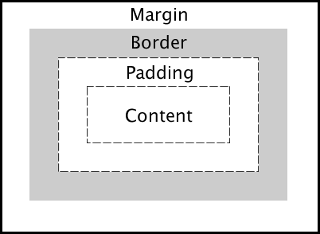
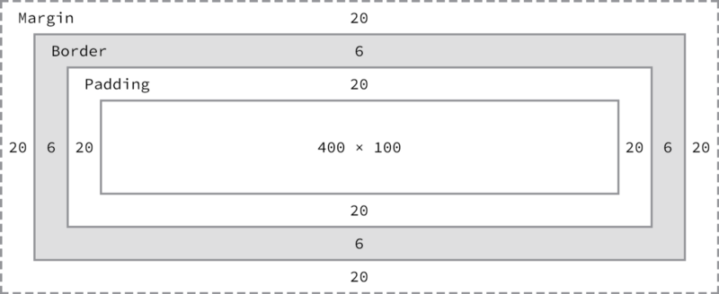

In a box-model, every element on a page is a rectangular box with some properties like content, width, margin, padding, height, width and border. The below image can define the box model.



**Box-Model properties in Detail**

**Content** The content of the box wherein the image containing text is shown.

**Padding** The Padding is shown outside the content. This property is applied to give the space outside the content. Here is some example to declare the padding.

**Shorthand property to define the padding.**

```
This property define the padding from all side.

div {
    padding: 20px;
  }

This property define the padding from Top,Bottom and Left,Right.

div {
    padding: 20px 50px;
  }

This property define the padding from Top, Right,Bottom and Left.
div {
  padding: 10px 0 20px 30px;
}
```

**Longhand property.**

```
div {
    padding-top: 20px;
    padding-right: 0;
    padding-bottom: 40px;
    padding-left: 50px;
  }
```

**Border** The Border is shown outside of the padding Border show in transparent. This property provides the outline around the content. To apply the border there are some important properties for e.g `border-width, border-style, and border-color`.

**Shorthand property to define the border.**

```
div {
	border: 10px solid red;
}
```

**Longhand property to define the border.**

```
div {
    border-bottom-width: 10px;
    border-bottom-style: solid;
    border-bottom-color: #272727;
  }
```

**Margin** The Margin is shown in the upper image outside the border. This property is the last property of the box model. It works outside the elements.

**Shorthand property to define the margin.**

```
This property define the margin from all side.

div {
    margin: 20px;
  }

This property define the margin from Top,Bottom and Left,Right.

div {
    margin: 20px 50px;
  }

This property define the margin from Top, Right,Bottom and Left.

div {
  margin: 10px 0 20px 30px;
}
```

**Longhand property.**

```
div {
    margin-top: 20px;
    margin-right: 0;
    margin-bottom: 40px;
    margin-left: 50px;
  }
```

**Height** Height is the measurement of horizontal distance to one side to the other side. It measures something from header to footer or top to bottom. Here is an example of how to use height.

```
div {
    height: 300px;
  }
```

**Width** Each element has a default width. It defined the distance to one side to another side. To set the width we can use e.g

```
div {
    width: 300px;
  }
```

### How to calculate the width and height of an element

This is a basic formula to calculate the width of the element.

```
margin-right + border-right + padding-right + width + padding-left + 

border-left + margin-left
```

To calculate the height of the element we can use

```
margin-top + border-top + padding-top + height + padding-bottom + 

border-bottom + margin-bottom
```

For example, ByuUsing the formulas, we can find the total height and width of our example code.

Width: `20px + 6px + 20px + 400px + 20px + 6px + 20px = 492px`

Height: `20px + 6px + 20px + 100px + 20px + 6px + 20px = 192px`

### **Box Sizing**

Box sizing allows for changing the calculation of the box-model. we can define the box-sizing properties with `content-box and border-box`Both properties are different.

**Content-box** In the content-box property. The box model any properties are not included within the width and height of an element. This provide the default properties to every element.

```
div {
    box-sizing: content-box;
  }
```

**Border-box** In the border-box property. The box model any properties like a border or padding property values are included within the width and height of an element.

```
div {
    box-sizing: border-box;
  }
```
