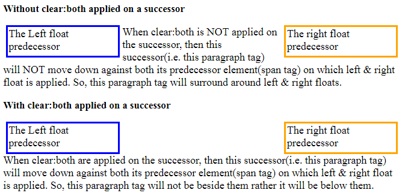
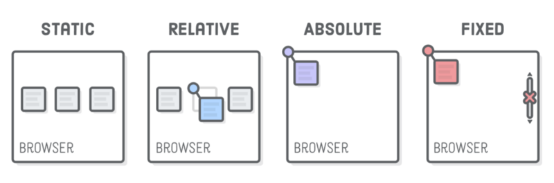

In CSS Positioning is the best thing it allows us to position the content on a page anywhere. It helps us to make the good structure of our design. There are a few different types of positioning in CSS.

### Positioning with Floats



Float helps us to position the elements of the web page with the help of float we can create the different kinds of layouts. The float comes with different values such as `left, right, and none`.

**Left** The element floats to the left of its container

**Right** The element floats to the right of its container

**None** The element does not float (will be displayed just where it occurs in the text). This is default

### Clearing the floats

Float affects the normal flow of the elements on a page. To remove the disadvantages or the effect of float we can use the clear float property to make the normal flow of element. The one of more useful technique to clear the float is Cleafix Technique.

```
.clearfix:before, .clearfix:after {
    content: "";
    display: table;
  }
  .clearfix:after {
    clear: both;
  }
```

### The position Property

The position property specifies the type of positioning method used for content (static, relative, fixed, absolute or sticky).



### Box offset properties

These properties are used to change the position of the element on the web page.

```
.box {
    position: relative;
    top: 60px
    right: 60px;
    bottom: 60px;
    left: 60px;
  }
```

**Position Static** Static positioned elements are not affected by the top, bottom, left, and right properties.

**Position Relative** This property is different from a static property. It accepts box-offset properties. we can move the element always normal flow. The position relative element do not disturb any element. This element moves from its point.

```
.box {
    position: relative;
    left: 60px;
    top: 60px;
  }
```

**Position Absolute** This property is different from the static and relative property. It accepts box-offset properties. we can move the element always normal flow. Position any elements absolutely it goes out of the flow and it is removed from the normal flow of the page. It's lost its original position and another element takes its position.

```
.box-2 {
    position: absolute;
    right: 0;
    bottom: 0;
  }
```

**Position Fixed** This element is different because it fixed the position of the element. It takes the window viewport not moved with the scrolling page.

```
.box {
    position: fixed;
    right: 60px;
    bottom: 60px;
  }
```
